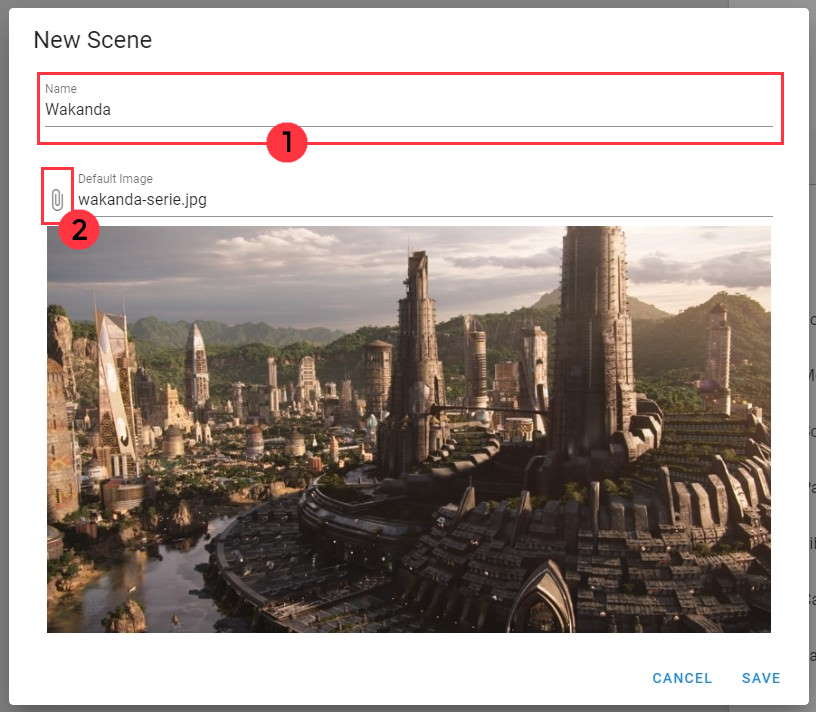

# 📚 Asset Management 

## 📃 Asset Manager Panel :

> The asset manager panel list all the assets you can use in your game.
There is one tab for each type of asset : **Character, Scene, Object, Music & Sound**.
# 
> All types of asset have a specific purpose
> - The **Character Asset** is an asset which can lead a dialogue & appear in screen.
> - The **Scene Asset** is an asset which can be put as the background of your game.
> - The **Object Asset** is an asset which can be add or remove from your inventory. The object can also be used to trigger a specific dialogue/event.
> - The **Music Asset** is a music which can be playe and it will loop until you stop this specific music.
> - The **Sound Asset** is a simple sound which can be played for one time.

## 📌 How to import an asset :

> To add an asset, switch in the appropriate tab for the type of the asset you want to import. Then click on the button **Add** with a "+" icon. A new window will then appear depending of the type of asset.

| Type of Asset  | Guide  | Image |
|:---|:---:|:---: |
| Character  |  <ol type="1"><li>Write here the name of your character</li><li> Import the default image your character will have </li><li> Panel to list all the feelings can take your character <ul> <li>A - Feeling/state that you character can have with an image and a name </li><li>B - Button to add a new Feeling/State</li></ol> </li></ul> |  |
|  Scene | <ol type="1"><li> Write here the name of your scene </li><li> Import the background image that the scene will have </li></ol>  |  |
|  Object |  <ol type="1"><li> Write here the name of your object </li><li> Import the image that the object will have </li></ol> |  |
|  Music & Sound | <ol type="1"><li> Write here the name of your music </li><li> Adjust the volume of your music with this slidebar </li><li> Import your music file here </li><li> Play and stop the music imported </li></ol>  |  |