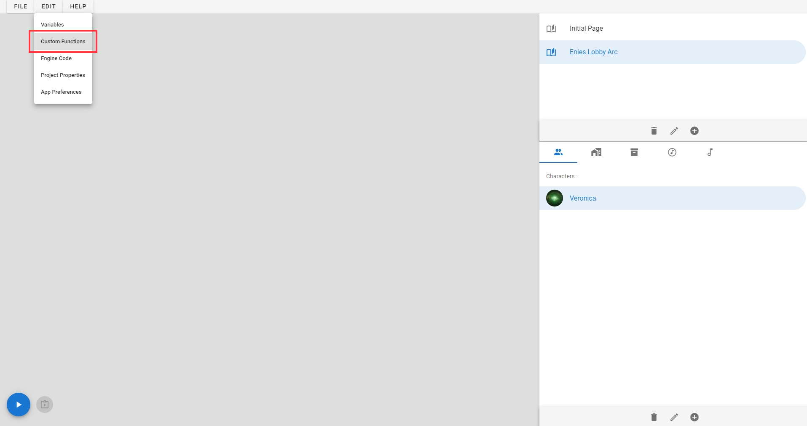
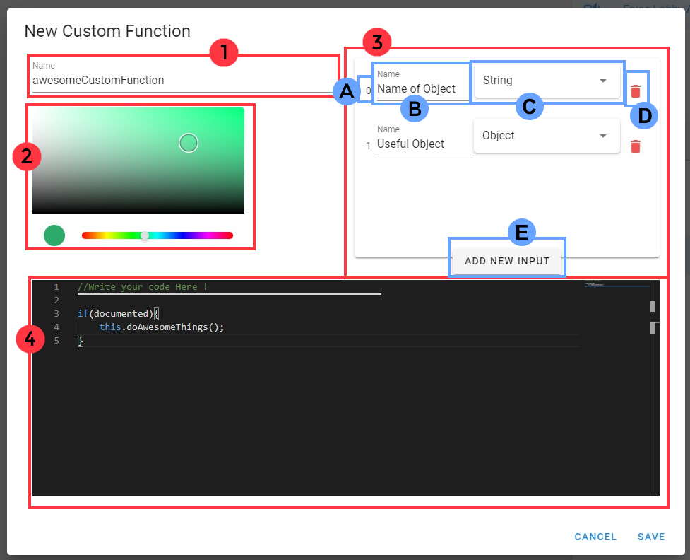

# 📚 Custom Functions

> Custom Function is a way to create your own function script. You need to know Javascript in order to code your own function.
> 
> The Custom Function panel can be found in the edit sub menu :
> # 

## 🧱 Edit/Create custom function :

> When opening the custom function panel. The list of all custom functions is showed. When you create a new project, the list is empty.
> To create a new custom function, just click on the "plus" button on the bottom bar. If you want to edit an existing one, just select the custom function in the list and click on the "pen" button. A new panel will then appear :
>
> | <ol type="1"><li> Write here the name of your function. </li><li> The color that will have your function in the script tab. </li><li> The list of all inputs of your function. <ul> <li>A - The index of the input. </li><li>B - Write the name of the input. (It's only for the visual in the script tab).</li> <li> C - Select the type of the input.</li><li>D - Delete Input Button.</li><li>E -  Add a new input.</li></ul> </li> <li> Write the code of your function here. </li></ol> |  |
> |:---:   |:---:   |

## 💻 How to code ? :

> ### 📢 Good to know :
> The game engine is made with Vue.js. 
> The code of your custom functions are stored in javascript file. This javascript is used as a "mixin" in the game engine. (See : https://fr.vuejs.org/v2/guide/mixins.html) It means that you can access all methods and variables of the engine like this ``` this.engineFunction(); this.engineVariable = true; ```

> ### 🎤 Inputs :
> The inputs of your function are stored in an array. You can know the index of each input with its number (See 3-A on the top image).
> Example by using Inputs :
>
> ```js
> let ArrayInput = input; // Store the input array in variable.
>
> input[0] // Acces the first input
> input[0].type.name // Acces the type of the input (String)
> this.getInputValue(input[0]) // return the value of the input. If the input is a reference to a variable, it will return the value of the variable.
> ```
