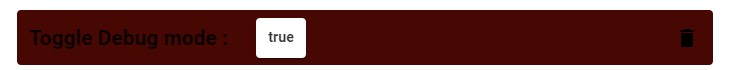
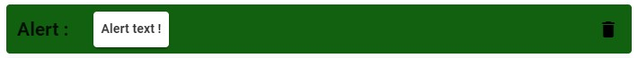

# ⚙ Debugging your game

## 📢 Debug Mode :
> The debug mode can be enabled by calling the function "Toggle Debug mode" and setting the parameter to true.

# 

> When the debug mode is enabled, you can print message in game to print information you need at the current state of the game with the "Alert" function.

# 

> The debug mode is also useful when you have bugs with your scripts and it tells you where does the problem comes from.
> 
> Note : the debug mode can't be enabled in a packaged game.

## 📃 Errors :

> Errors append when you have done something wrong in your script. The error have this format :
> 
[Dialogue] [Function] [Input] Error #XXX : info
- Dialogue : Dialogue where the error comes from
- Function : Function where the errors is throwed
- Input : Numero of input parameter which cause the error (if the issue comes from a parameter value)
- XXX : Numero of the error
- info : text information about the error

> Here the list of all errors handled by the debug mode.
> 
| Numero |                                                                                                                                                Error explanation                                                                                                                                                 |
|:-------|:----------------------------------------------------------------------------------------------------------------------------------------------------------------------------------------------------------------------------------------------------------------------------------------------------------------:|
| #001   |                                                                             This error happens when you have set an input parameter to the value null when calling a function.   By default : the game will ignore the function                                                                              |
| #002   |                                                          This error happens when the variable value can't be read, it can occurs if you give a wrong type of variable for a specific parameter.     By default : the game will ignore the function                                                           |
| #003   |                                                                                    This error happens when the asset in function parameter is not find in your project.    By default : the game will ignore the function                                                                                    |
| #004   |                                                  This error happens when you have set an input parameter to the value null when calling a function which requires a variable which cannot be set to null.    By default : the game will ignore the function                                                  |
| #005   |                                                                        This error happens when you use the remove/give object function and when you set the amount parameter to 0.    By default : the game will ignore the function                                                                         |
| #006   |                                           This error happens when your "if" function is corrupted due to an external bug. You may need to delete the function.    By default : the game will ignore the function and all functions included in the "if" function.                                            |
| #007   |                                                        This error happens when you use the "delay" function with a delay value inferior or equals to 0. The delay should be a positive value.   By default : the game will ignore the delay function.                                                        |
| #008   |                                                                                      This error happens when the game tries to read the value of an unknown variable.   By default : the game will ignore the function                                                                                       |
| #009   |                                                                    This error happens with a set function with a corrupted value parameter. You may need to delete the "set" function.    By default : the game will ignore the function                                                                     |
| #010   |                                                                            This error happens when you try to change the state of a character who are not on the current scene.    By default : the game will ignore the function                                                                            |
| #011   |                                                                This error happens when you try to change the state of a character and the value of new state is not specified in parameter.    By default : the game will ignore the function                                                                |
| #012   |                                                            This error happens when you try to change the state of a character and the value of new state is unknown for the specific character.    By default : the game will ignore the function                                                            |
| #013   |                                                                   This error happens when you try to remove a character from the scene for a character who are not on the current scene.    By default : the game will ignore the function                                                                   |
| #014   |                                                                                       This error happens when you try to stop a music which is not currently played.    By default : the game will ignore the function                                                                                       |
| #015   |                                                                            This warning happens when you try to use an item which is not useful for the current dialogue/choice.    By default : the game will ignore the action                                                                             |
| #016   |                                 This error happens when you try to read the value of an array with an invalid index. It can happen if the index is out of bound the array (> the length of array) or if the index is < 0.    By default : the game will ignore the function                                  |
| #017   | This error happens when you have an infinite loop. It means that you have your loop function is always running and is never stopped.     !! By default !! : the game will run the loop forever, you will not be able to go to the next dialogue if you checked the "wait the end of all script..." checkbox. |