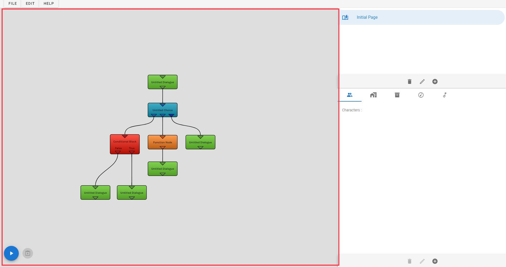
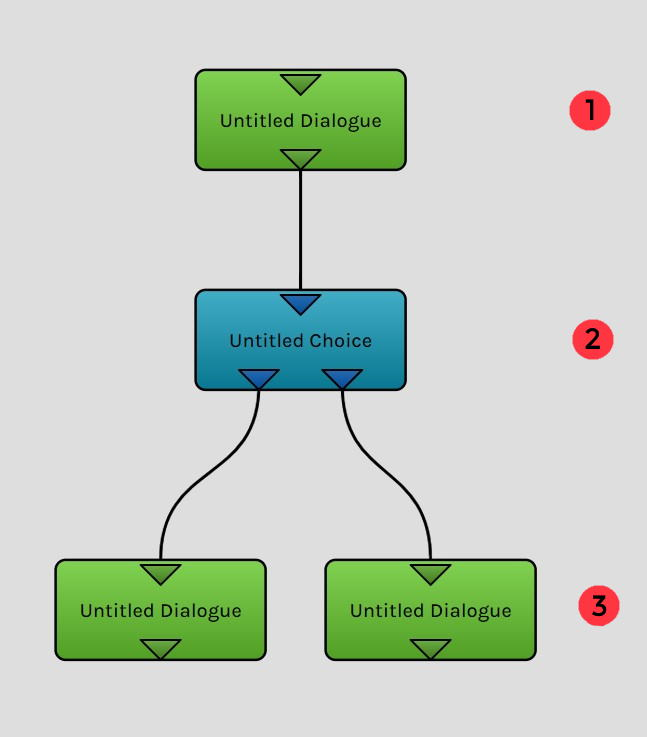
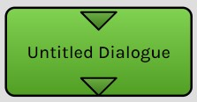
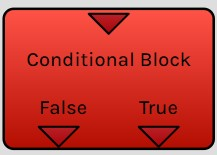

# 📚 Dialogues

## 📃 Dialogue Manager Panel :

>Note : The documentation below contains old images from an older version of the app.

> The dialogue manager panel is used to create the storyline of the game. The dialogues are represented with nodes and links.
># 
> Nodes and links are seperated within pages. They are visible on the right top corner of the app.
> You can create pages as many as you want.
>
> You can test your game by clicking on the play button in the bottom left corner. Before that, you need to have an initial dialogue. Right-click on a dialogue and select "Set Initial Dialogue" to set the first dialogue. When making your game, you can play the game from a specific moment. Just a select a single node and click on the green button next to the play button. The game will be launched from the selected node.
> 
> A dialogue node can have input and output(s). The top plug represent the input. A plug can have many inputs dialogues. The bottom plug(s) represent(s) the output. One plug represents one output.
> 
> See an execution order :
> 

## 🧱 List Of Nodes :

> You have 6 types of nodes. Every type has a special usefulness.
> A node can be put by right-clicking in dialogue manager and by selecting the type you want.
> You can also use your keyboard's numbers to put the node depending on its ID.
>
> | Name  | ID | Utility  | Visual |
> |:---:|:---:|:---:|:---: |
> | Dialogue Node | 1 | This node is used to play a dialogue in the game. |   |
> | Choice Node | 2 | This node is used to show a choice to the player. Depending on the choice of the player, a different output node will be executed. |   |
> | Conditional Node | 3 | This node execute one of its 2 outputs depending on a condition. |   |
> | Function Node | 4 | This node execute scripts when it is executed. |   |
> | Input Node | 5 | This node works the same as the dialogue node but it also show an input bar to the payer. The player can submit a value (String or Integer) and this value will be saved in a variable. |   |
> | Transition Page Node | 6 | This node is used to make a link between two nodes of different pages. |   |

## ⚙ Node Configuration :

> You can edit a node by double-clicking on it or by right-clicking it and selecting "Edit Node".
> The node configuration is seperated in different tabs :

> ### Dialogue Tab :
> This tab is specific to dialogue, choice & input nodes.
> 
> | <ol type="1"><li> You can write here the name of the node. </li><li> You can select the character who is speaking in this dialogue. If you want a custom name just select null. </li><li> If the speaker character is set to null. You can write here the name that will be showed on top of the dialogue's text. </li> <li> Write here the dialogue's text. </li></ol> |  |
> |:---:   |:---:   |

> ### Choice Tab :
> This tab is specific to choice node.
> 
> | <ol type="1"><li> Button used to add a new choice.</li><li> Button used to add a object use. It means that the player will be able to use a specific object instead of making a choice. </li><li> List of all the choices and object uses. <ul> <li>A - Logo which indicates the type between choice or object use. </li><li>B - The text showed for the choice.</li> <li> C - If it's a choice : Set here a condition, if the condition is equal to false, this choice will not be showed. If it's an object : Set here the object that can be used. </li><li>D - Delete button. </li></ol> </li></ul> |  |
> |:---:   |:---:   |

> ### Script Tab :
> This tab is specific to dialogue, choice, input & function nodes.
> 
> The script tab is the most complex tab, and it is used to execute scripts function. See [Scripting Documentation](https://github.com/yami2200/visualnovelmaker/blob/master/DOC/doc_Scripting.md) for more info.

> ### Condition Tab :
> This tab is specific to conditional node.
>
> | <ol type="1"><li> You can write here the name of the node. </li><li> You can set here the boolean condition. The output will be executed depending on this value </li></ol> |  |
> |:---:   |:---:   |

> ### Input Tab :
> This tab is specific to input node.
> 
> | <ol type="1"><li> Select here the type of the input. (String = Text & Integer = Integer number) </li><li> Set here the variable which where the value will be stored. </li> <li> If the type is a String : you can set here the minimum and maximum length of the text. If it's a integer : You can set the minimum and maximum value of the number. </li></ol> |  |
> |:---:   |:---:   |

> ### Transition Tab :
> This tab is specific to transition node.
>
> | <ol type="1"><li> You can write here the name of the node. </li><li> Select here the page you want to go to. </li></ol> |  |
> |:---:   |:---:   |