# 📚 Scripting

>You can create script event in specific dialogues.
> 
> See [Dialogues Documentation](https://github.com/yami2200/visualnovelmaker/blob/master/DOC/doc_Dialogues.md) to know the list of dialogues.

> To start scripting, double click on a dialogue to edit it. Then navigate in the tab Script :

| <ol type="1"><li> If you check this, the player will not be able to go to the next dialogue before all the scripts are executed. It's usefull when you use delay and you don't want the player to leave the dialogue before the end. </li><li> Script Functions list <ul> <li>A - Function script. </li><li>B - Gray bar button. Click this button to add a script function at this position.</li></ol> </li></ul> | 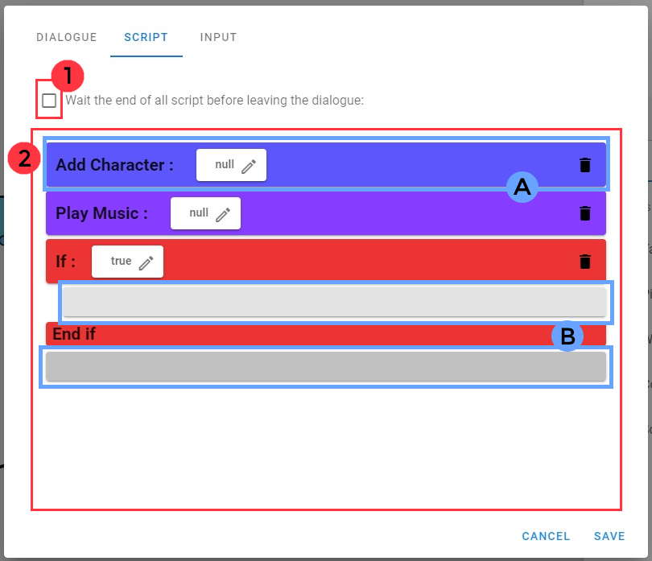 |
|:---:   |:---:   |

##  📌 How to Call/Use a function :
> To call a function in a dialogue, you juste have to click on a gray bar button. A window with the list of all functions will then appears.
>
>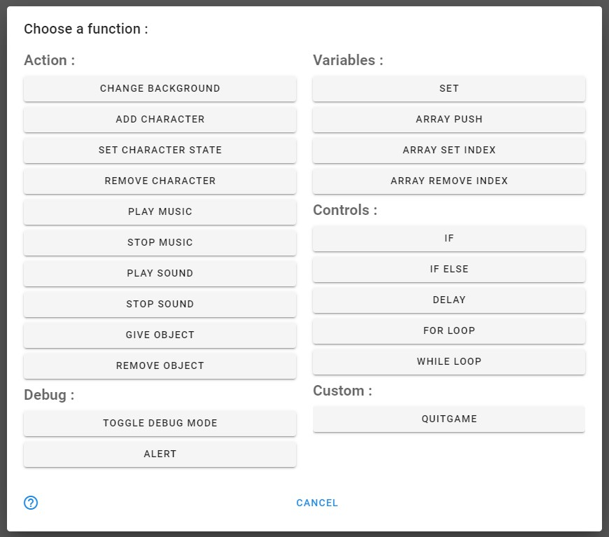

> Here is now the list of all functions with their parameters & their actions.

> You can also insert new function above or below an other one by hovering with mouse a side of a function and then right click:
> 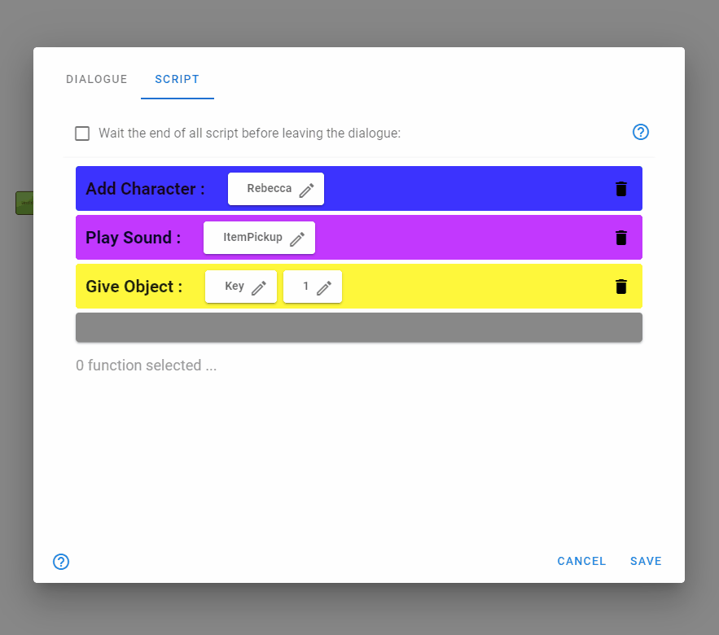

> You can also paste functions like this :
>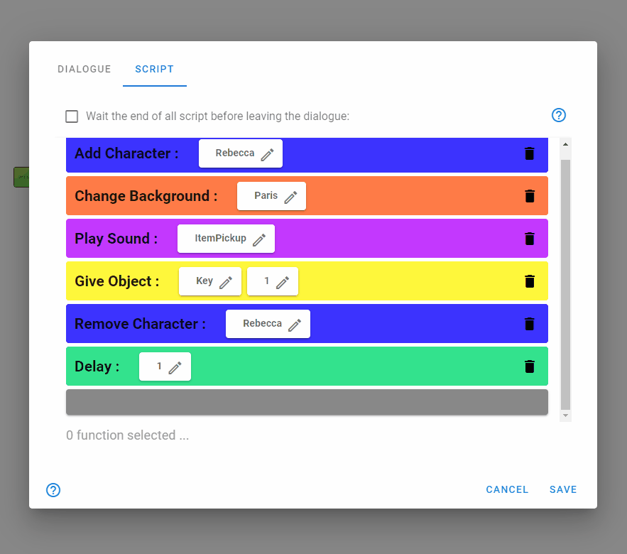

> In order to manipulate functions correctly, you can select them with left click. If you press CTRL, you can select many of them at the same time.

> ### Actions :
> > Actions Functions change some visual or audio elements in game.
> 
> | Function Name | Function Description | Function Parameters | Image |
> |:---|:---:|:---:|:---:|
> | Change Background  | This function change the background of the game with a scene asset. | <ol type="1"><li> **[Scene]** : The scene to put in the background </li></ol>   | 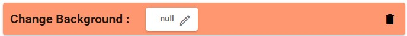 |
> | Add Character  | This function add a character with its default image in the current scene. | <ol type="1"><li> **[Character]** : The character to show </li></ol>   | 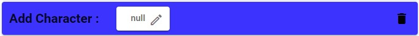 |
> | Set Character State | This function change the state/feeling of a character only if the character is on the scene. | <ol type="1"><li> **[Character]** : The character you want to change the state </li><li> **[String]** : The name of the new state. </li></ol>   | 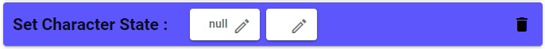 |
> | Remove Character  | This function remove a character if this character is in the current scene. | <ol type="1"><li> **[Character]** : The character to hide </li></ol>   | 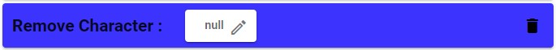 |
> | Play Music  | This function play a music. | <ol type="1"><li> **[Music]** : The music to play </li></ol>   | 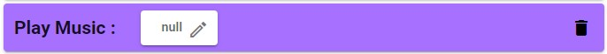 |
> | Stop Music  | This function stop a music. | <ol type="1"><li> **[Music]** : The music to stop </li></ol>   | 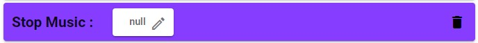 |
> | Play Sound  | This function play a sound. | <ol type="1"><li> **[Sound]** : The sound to play </li></ol>   | 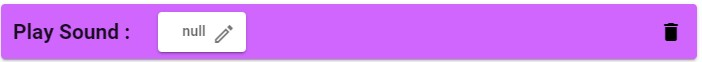 |
> | Stop Sound  | This function stop a sound. | <ol type="1"><li> **[Sound]** : The sound to stop </li></ol>   | 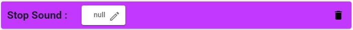 |
> | Give Object | This function give to the player's inventory an amount of the same object. | <ol type="1"><li> **[Object]** : The object you want to give. </li><li> **[Integer]** : The amount you want to give. </li></ol>   | 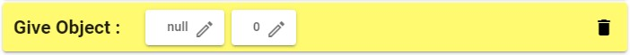 |
> | Remove Object | This function remove to the player's inventory an amount of the same object. | <ol type="1"><li> **[Object]** : The object you want to remove. </li><li> **[Integer]** : The amount you want to remove. </li></ol>   | 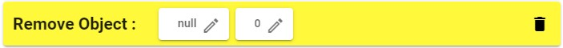 |

> ### Variables :
> > Variables functions have no visual impact. They only change values of variables.
> 
> | Function Name | Function Description | Function Parameters | Image |
> |:---|:---:|:---:|:---:|
> | Set | This function set the value of a variable. | <ol type="1"><li> **[Variable]** : The variable you want to set. </li><li> **[VariableType]** The new value of the variable.</li></ol>   | 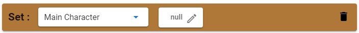 |

> ### Controls :
> > Controls functions have an impact on the others functions which come next.
> 
> | Function Name | Function Description | Function Parameters | Image |
> |:---|:---:|:---:|:---:|
> | If | Execute all functions between *If bar* & *End if bar* if a boolean/condition value is true. | <ol type="1"><li> **[Boolean]** : Condition which has to be true to execute the next functions below. </li></ol>   | 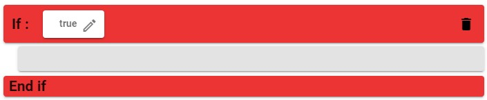 |
> | If Else | Execute all functions between *If bar* & *Else bar* if a boolean/condition value is true. If the boolean is false, it executes all functions between *Else bar* & *End if bar*. | <ol type="1"><li> **[Boolean]** : Condition which has to be true to execute the next functions below. </li></ol>   | 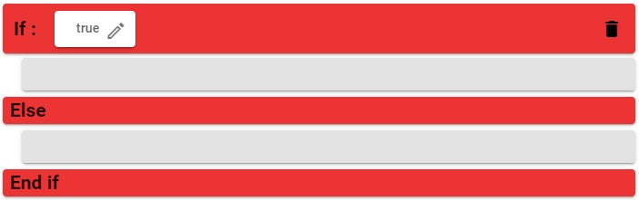 |
> | Delay | Wait a specific duration before executing the next function which comes below. | <ol type="1"><li> **[Float]** : The duration you want to wait for. </li></ol>   |  |

## 📃 Some other information :

> ### Function Script Context Menu :
> You can right click on a function script to open a context menu. It allows you to insert new functions between two others. You can also move a function on the top. 

> ### Delays in If Function :
> Delay function in **if block** has also an impact on functions which are not in this block.
>
> Let's see the execution of an example :
> 
> | <ol type="1"><li> First of all, it changes the background with the Forest Scene. </li><li> Then we arrive in a if function. We see that the condition is equal to true. So we execute functions in it. </li><li> We play the music Nyancat. </li><li> Then we have a delay of 3 seconds. Even if there is no function after the delay in the **if block**. The delay will take effect and we will leave the **if block** only after 3 seconds. </li><li> After the 3 seconds delay, the background is changed with the mountain scene asset. </li></ul> | 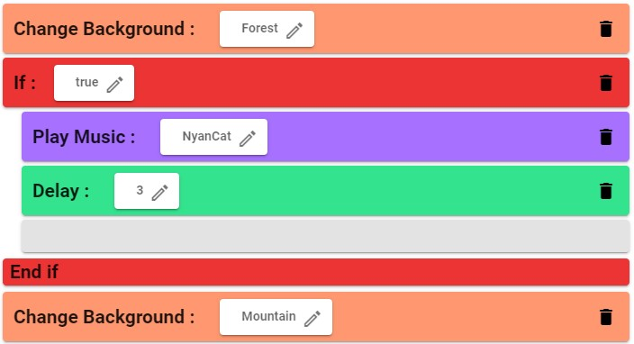 |
> |:---:   |:---:   |

> ### Useful Shortcuts :
> You can press CTRL + C to copy selected functions.\
> You can press CTRL + X to cut selected functions.\
> You can press CTRL + V when hovering a function's side, to paste functions above or below.\
> You can press Delete to delete selected functions.