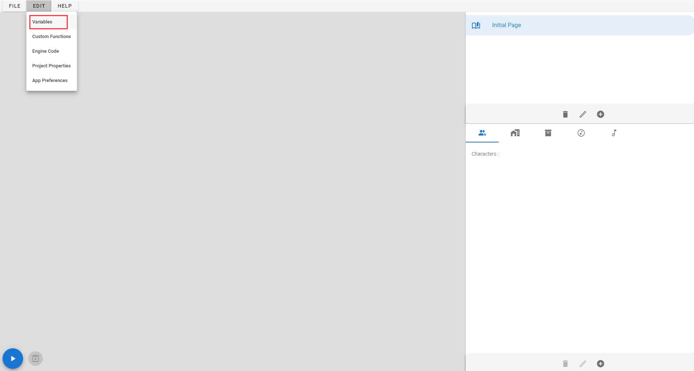
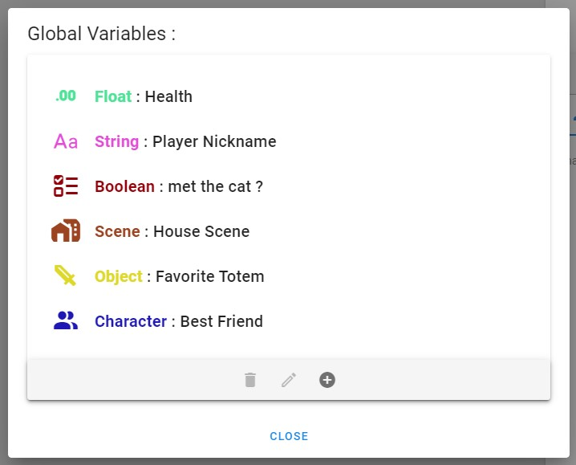
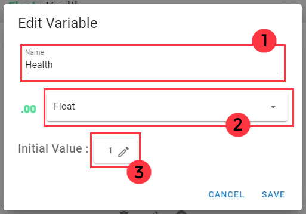
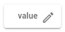
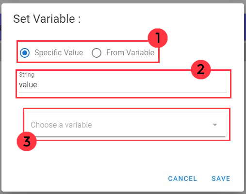
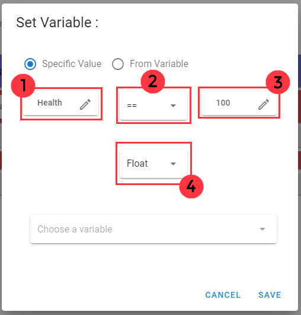

# 📚 Variables

## 📃 Variable Panel :

>The variable panel can be found in the edit menu in the top bar of the app.

# 

> This panel is useful for the management of the global variables of your game. This global variables can be use to store
> specifics value of differents types :

| Type of Variable  | Description  |
| :---:| :---: |
| Integer | Store an integer number |
| Float | Store a float number |
| Boolean | Store a variable that can take 2 values : **true** or **false** |
| String | Store a line of text |
| <ul><li>Character</li><li>Scene</li><li>Object</li><li>Music</li><li>Sound</li></ul> | Variable able to store a reference of a specific asset |

> When you open the variable panel, the list of all the variables of the project appears.

# 

## 📌 How to Add/Edit a variable :

> To **add** a variable, just click on the button **Add** with a "+" icon. To **edit** one, just select the variable and click on the button with a **Pen Icon**.

| <ol type="1"><li> Write here the name of your variable </li><li> Select the type of the variable </li><li> Set the initial value of the variable when the game will be launched </li></ol> |  |
|:---:   |:---:   |

## 🔧 How to set the value of a variable/parameter :

> To set the value of variable, you will need to add the script function **Set** in a dialogue script. You can also use the script functions **Set Random Integer** or **Set Random Float** to set the variable with a random value. 
>
>See [Scripting Documentation](https://github.com/yami2200/visualnovelmaker/blob/master/DOC/doc_Scripting.md#variables-) to know how to use these functions.

> String & Integer Variables can also be set with the input Dialogue. The selected variable take the value that the player give in game.
> 
> See [Dialogues Documentation](https://github.com/yami2200/visualnovelmaker/blob/master/DOC/doc_Dialogues.md) to know how it works.

> You will see in many UI of the app the setter variable component :
> 
> 
> 
> To set the value, you just have to click on the **pen icon**. A new window will then open :

| <ol type="1"><li> This radio buttons specify if you want to set the variable with a specific value or if you want to set the value with the value of another variable. </li><li> Set a specific value. (*Takes effect only if the button "Specific Value" is checked.*) </li><li> Select another variable you want to get the value for the variable you are setting. (*Takes effect only if the button "From Variable" is checked.*) </li></ol> |  |
|:---:   |:---:   |

> Note : it exists specific setter for some types of variable. Here are the differences :

| Type of variable | Guide | Screenshot |
| :---: |:---:   |:---:   |
| Boolean Variable | In the case of boolean variable, you can set the value with a comparison. For example, you can check if a variable is equal to a specific value or greater than another one ... <ol type="1"><li> You can set here the first value to compare. </li><li> You can select with this menu the comparison operator ( > , = , < , >= , <= ) </li><li> You can set here the second value to compare with the first one. </li><li> You can select here the types of the 2 values you want to compare.</li></ol> |  |
| Integer & Float Variables | In the case of integer & float variables, you can set the value with an operation between two values. For example, you can set an integer with the sum of two others ... <ol type="1"><li> You can set here the first value of the operation. </li><li> You can select with this menu the type of operation ( + , - , x , / ) </li><li> You can set here the second value of the operation. </li><li> You can select here the types of the 2 values you want to compare.</li></ol> |  |

## 📃 Some other information :

> ### Initial Value :
> When you set an initial value of a variable, you can only set with a specific value. You can't set it depending on another variable.

> ### Show a variable value in a text dialogue :
> You can show the value of a variable in a text by adding this text format in your dialogue : ${variable_name}
> - Example : You have ${money} $ -> You have 10 $. (if money = 10)