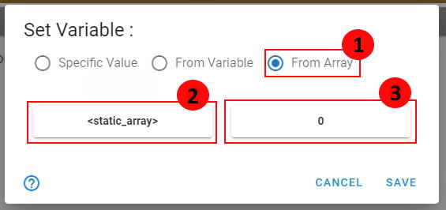

# 📚 Variables

## 📃 Variable Panel :

>The variable panel can be found in the edit menu in the top bar of the app.

# 

> This panel is useful for the management of the global variables of your game. This global variables can be used to store
> specific values of different types :

|                                                                                                                          Type of Variable                                                                                                                           |                                        Description                                         |
|:-------------------------------------------------------------------------------------------------------------------------------------------------------------------------------------------------------------------------------------------------------------------:|:------------------------------------------------------------------------------------------:|
|                                                                                                             Integer                                                                                                              |                                  Store an integer number                                   |
|                                                                                                              Float                                                                                                               |                                    Store a float number                                    |
|                                                                                                             Boolean                                                                                                              |              Store a variable that can take 2 values : **true** or **false**               |
|                                                                                                              String                                                                                                              |                                    Store a line of text                                    |
|                                                                                                              Array                                                                                                               | Store an array/list of other variables of one type (ex: Array of integers, array of array) |
| <ul><li>Character</li><li>Scene</li><li>Object</li><li>Music</li><li>Sound</li></ul> |                   Variable able to store a reference of a specific asset                   |

> When you open the variable panel, the list of all the variables of the project appears.

# 

## 📌 How to Add/Edit a variable :

> To **add** a variable, just click on the button **Add** with a "+" icon. To **edit** one, just select the variable and click on the button with a **Pen Icon**.

| <ol type="1"><li> Write here the name of your variable </li><li> Select the type of the variable </li><li> Set the initial value of the variable when the game will be launched </li></ol> |  |
|:------------------------------------------------------------------------------------------------------------------------------------------------------------------------------------------:|:-----------------------------------------:|

## 🔧 How to set the value of a variable/parameter :

> To set the value of variable, you will need to add the script function **Set** in a dialogue script. You can also use the script functions **Set Random Integer** or **Set Random Float** to set the variable with a random value. 
>
>See [Scripting Documentation](https://github.com/yami2200/visualnovelmaker/blob/master/DOC/doc_Scripting.md#variables-) to know how to use these functions.

> String & Integer Variables can also be set with the input Dialogue. The selected variable take the value that the player give in game.
> 
> See [Dialogues Documentation](https://github.com/yami2200/visualnovelmaker/blob/master/DOC/doc_Dialogues.md) to know how it works.

> You will see in many UI of the app the setter variable component :
> 
> 
> 
> To set the value, you just have to click on the **pen icon**. A new window will then open :

> You can set a variable in 3 different ways :
> - Set with a specific value
> - Copy the value of another variable
> - Copy the value of an element from an array

| <h3> Set with a specific value :</h3> <ol type="1"><li> This radio buttons specify that you set the variable with a specific value. </li><li> Write here the new value of the variable. </li></ol> <h3> Set with a specific value with an operator : </h3> <ol type="1"><li> This radio buttons specify that you set the variable with a specific value. </li><li> Specific operator or function that will process the value you write before setting the variable. </li><li> Write here the new value of the variable. </li></ol> |   |
|:----------------------------------------------------------------------------------------------------------------------------------------------------------------------------------------------------------------------------------------------------------------------------------------------------------------------------------------------------------------------------------------------------------------------------------------------------------------------------------------------------------------------------------:|:-------------------------------------------------------------------------------------------------------------------------:|
|                                                                                                                                                <h3> Copy the value of another variable :</h3>   <ol type="1"><li> This radio buttons specify that you set the variable with a value from another variable. </li><li> Select here the specific variable you want to copy. </li></ol>                                                                                                                                                |                                                                     |
|                                                                                                               <h3> Copy the value of an element from an array :</h3>   <ol type="1"><li> This radio buttons specify that you set the variable with a specific value from an array. </li><li> The array where you want to get an element. </li><li> Position/index of the element to copy to the variable. </li></ol>                                                                                                               |                                                                        |
> Note : it exists specific setter for some types of variable. Here are the differences :

<h2> Boolean :</h2>

| Operators  |                                                                                                                                  Guide                                                                                                                                  |                          Screenshot                          |
|:----------:|:-----------------------------------------------------------------------------------------------------------------------------------------------------------------------------------------------------------------------------------------------------------------------:|:------------------------------------------------------------:|
|   Value    |                                                         <ol type="1"><li> If the operator is set to value, you just have to check the checkbox to set the variable to true, or uncheck it for false. </li></ol>                                                         |       |
| Comparison |                                 Comparison operators : <, >, <=, >= <ol type="1"><li> **[Float]** The first value to compare </li> <li> **[Float]** The second value to compare </li></ol> Screenshot : compute the comparison : a > b                                  |  |
|   Equals   | <ol type="1"><li> **[see 3]** The first value to compare </li> <li> **[see 3]** The second value to compare </li>  <li> **[VariableType]** Select the variable type of both values you want to test the equality. </li></ol> Screenshot : compute the equality : a == b |       |
|    Not     |                                                    <ol type="1"><li> If the operator is set to not, you can write here a boolean variable (value/operation etc.) and it will compute the inverse result.  </li></ol>                                                    |         |

<h2> Float & Integers :</h2>

|  Operators  |                                                                                                            Guide                                                                                                             |                        Screenshot                        |
|:-----------:|:----------------------------------------------------------------------------------------------------------------------------------------------------------------------------------------------------------------------------:|:--------------------------------------------------------:|
|    Value    |                                                     <ol type="1"><li> If the operator is set to value, you just have to write the new value you want to set. </li></ol>                                                      |     |
|  Operation  |            List of operations : +, -, *, /        <ol type="1"><li> **[Float]** First value of operation </li> <li> **[Float]** Second value of operation </li> </ol>  Screenshot : compute the operation : a + b            |  |
|    Power    |                          <ol type="1"><li> **[Float]** The value of the base of the power </li> <li> **[Float]** The value of the power </li> </ol>       Screenshot : compute the operation : a^b                           |     |
| Exponential |                                                     <ol type="1"><li> **[Float]** The power of exponential </li></ol>           Screenshot : compute the operation : e^a                                                     |       |
| Min or Max  |                              <ol type="1"><li> **[Float]** First value </li> <li> **[Float]** Second value </li></ol>      Screenshot : set the variable with the minimum value between a and b                              |    |
|   Random    |                        <ol type="1"><li> **[Float]** Minimum value </li> <li> **[Float]** Maximum value </li></ol>   Screenshot : set the variable with a random value between a and b (a <= x <= b)                         |    |
|   Length    | Set the variable with the length of an array (number of element the array contains)                                                        <ol type="1"><li> **[Array]** The array you want to measure the length </li></ol> |    |

<h2> String :</h2>

| Operators |                                                                                                                                         Guide                                                                                                                                          |                        Screenshot                         |
|:---------:|:--------------------------------------------------------------------------------------------------------------------------------------------------------------------------------------------------------------------------------------------------------------------------------------:|:---------------------------------------------------------:|
|   Value   |                                                                               <ol type="1"><li> If the operator is set to value, you just have to write the text value of the variable here. </li></ol>                                                                                |     |
|  Concat   |                             Concatenate two string values : <ol type="1"><li> **[String]** First string value to concatenate. </li><li> **[String]** Second string value to concatenate. </li></ol>   Screenshot : concatenate text1 + text2 = text1text2                              |    |
| ToString  | The variable is set with a value of a different type which is transformed in string                  <ol type="1"><li> **[VariableType]** Select here the variable type you want to transform in String. </li> <li> **[see 1]** The value you want to transform in string. </li> </ol> |  |

## 📃 Some other information :

> ### Initial Value :
> When you set an initial value of a variable, you can only set with a specific value. You can't set it depending on another variable.

> ### Show a variable value in a text dialogue :
> You can show the value of a variable in a text by adding this text format in your dialogue : ${variable_name}
> - Example : You have ${money} $ -> You have 10 $. (if money = 10)
> 
> You can also show the value stored in an array :
> - Example : You have ${moneyBank[0]} $ -> You have 10 $. 
> - Example 2 :You have ${moneyBank[walletIndex]} $ -> You have 10 $.
