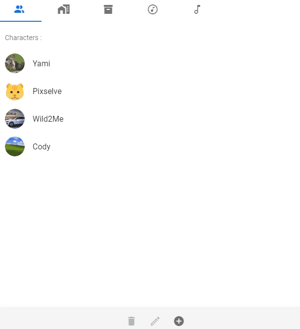

# 🎨🧱 Visual Novel Creator 

## ⭐ Getting started

>Visual Novel Creator is an application/game engine to make Visual Novel games.
> 
> Download the latest version here : [Visual Novel Creator 1.0.2](https://github.com/yami2200/visualnovelcreator/releases/tag/v1.0.2)

## 📚 Manage your assets :
>For every project, you will be able to manage & list all your assets. Import new assets, edit & delete old ones ...

# 

> For more info,check [the Asset Manager Documentation](https://github.com/yami2200/visualnovelmaker/blob/master/DOC/doc_AssetManager.md).

## 📢 Dialogue Manager :
>To make your storyline, you will able to use a practical and simple graph system.

# 

> Check the [Dialogue Documentation](https://github.com/yami2200/visualnovelmaker/blob/master/DOC/doc_Dialogues.md) for more info.

## 🧱 Scripting :
>In order to create events and logic system, you will access to a flexible and powerful scripting system. With the scripting system, you can create complex events & logics without any skill in computer science.
> 
> Check the [Scripting Documentation](https://github.com/yami2200/visualnovelmaker/blob/master/DOC/doc_Scripting.md) for more info.

# 

> You can declare global variables to store important values, check the [Variables Documentation](https://github.com/yami2200/visualnovelmaker/blob/master/DOC/doc_Variables.md) for more info.

>To make a system which is not handled by the scripting system. You have access to an editor with all the code (HTML/JS/CSS) that you can edit like you want.
> 
> You can also create your own functions which can be called in the script tab but execute your own code, check [Custom Function Documentation](https://github.com/yami2200/visualnovelmaker/blob/master/DOC/doc_CustomFunctions.md).

## ⚙ Tech :

>For this project, I use the framework VueJS v2 with Electron. For quick visuals, I use Vuetify.
The game itself is made with VueJs v3.

## 🌍 You want to help ?

>Feel free to contribute to the project by any way you want.
