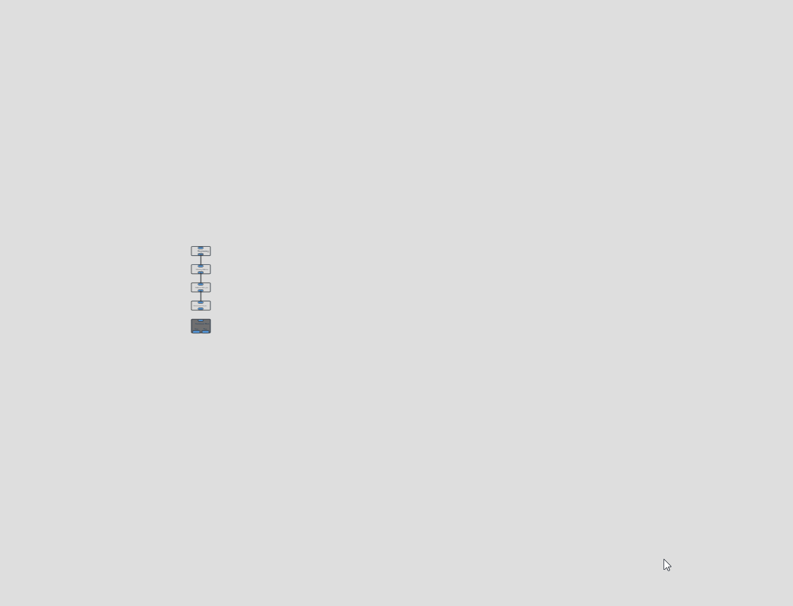

# 🎨🧱 Visual Novel Maker 

## ⭐ Getting started

Visual Novel Maker is an application/game engine to make Visual Novel games.

## 📚 Manage your assets :
For every project, you will be able to manage all your assets in one app. Import new assets, edit old ones ...

# 

## 📢 Dialogue Manager :
For your games, you will able to create all the dialogues and choices that the players will make.

# 

## ⚙ Tech :

For this project, I use the framework VueJS with Electron. For quick visuals, I use Vuetify.

## 🌍 You want to help ?

Feel free to contribute to the project by any way you want.